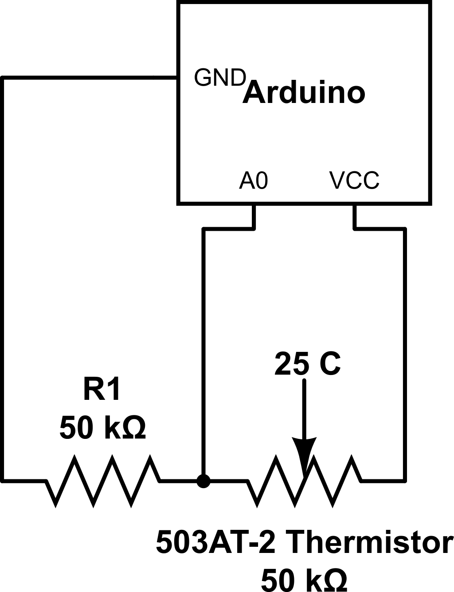

Takes a Thermistor reading and converts it to Fahrenheit. Needs the resistance of the added resistors. Currently valid for 0 to 95 F. To get better accuracy outside that range, split the resistance ranges of the thermistor and perform a logarthmic regression upon each interval.

Ideal circuit

